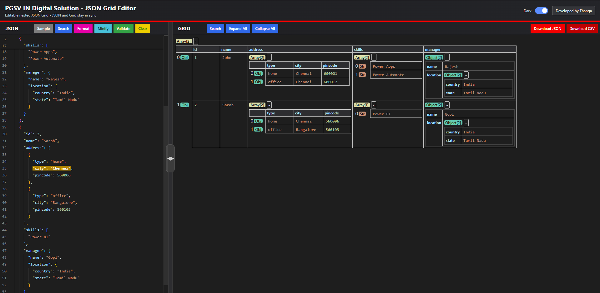

# JSON Grid Editor - Project Guide

## Overview
JSON Grid Editor is a standalone browser-based tool to view, edit, and validate nested JSON in two synchronized views:
- Left panel: JSON text editor (Monaco with textarea fallback)
- Right panel: Interactive grid for nested JSON values

Changes made in either side are reflected immediately on the other side.

## Demo

## Key Benefits
- Fast JSON editing with grid convenience: edit complex nested structures without manually hunting through raw JSON.
- Two-way sync: JSON text updates the grid, and grid edits update JSON instantly.
- Nested JSON support: handles objects, arrays, and mixed structures.
- Better readability: expand/collapse nested data to focus only on what matters.
- Built-in productivity tools: format, minify, validate, search, sample load, and clear.
- Visual traceability: edited grid field is highlighted in JSON editor.
- Export ready: download data as JSON or CSV.
- Flexible layout: draggable split divider and resizable grid columns.
- Theme support: light/dark mode for better usability.
- Zero build required: single HTML file runs directly in browser.

## Features Included
- Sample JSON loader
- JSON search
- Format JSON
- Minify JSON
- Validate JSON
- Clear editor
- Grid search
- Expand all / Collapse all
- Column resize support
- Auto column width based on max(header length, cell value length)
- Download JSON
- Download CSV

## How to Use
1. Open the application
- Open `json-grid-editor.html` in a browser.

2. Load data
- Paste valid JSON in the left panel, or click `Sample` to load example data.

3. Edit JSON directly
- Modify JSON in the left editor.
- The grid updates automatically when JSON is valid.

4. Edit via grid
- Edit any editable cell in the grid panel.
- JSON text updates instantly.
- The corresponding JSON field is highlighted for easier tracking.

5. Manage JSON structure
- Use `Expand All` / `Collapse All` in grid panel to navigate nested values quickly.
- Resize columns using the header resizers.

6. Use JSON tools
- `Search` (JSON panel): find text in JSON.
- `Format`: prettify JSON.
- `Minify`: compact JSON.
- `Validate`: check JSON validity.
- `Clear`: clear current content.

7. Use grid tools
- `Search` (GRID): highlight matching values.
- `Download JSON`: export current data to JSON file.
- `Download CSV`: export flattened dataset to CSV.

## Input Expectations
- Best experience with:
  - Array of objects
  - Nested objects and arrays
- Invalid JSON is allowed while typing, but full sync occurs once JSON becomes valid.

## Typical Workflow
1. Paste source JSON.
2. Click `Validate`.
3. Use grid to edit business values quickly.
4. Use JSON panel for structural or bulk edits.
5. Export as JSON or CSV.

## Notes
- Monaco editor loads from CDN. If unavailable, textarea fallback is used.
- For very large JSON payloads, rendering and synchronization may take longer.

## Project File
- Main app: `json-grid-editor.html`
- Optional sample data file in workspace: `check.json`

## Suggested Future Improvements
- Keyboard navigation between grid cells
- Undo/redo stack for grid edits
- Schema-aware validation and type hints
- Diff view before export
